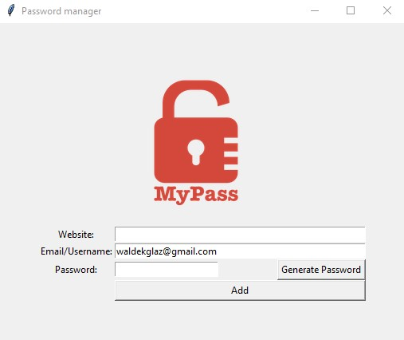

# Password Manager

Password Manager app will save your login details and if you wish will generate very secure password for you. All data will be stored in txt file

## Table of contents

- [Overview](#overview)
  - [The challenge](#the-challenge)
  - [Screenshot](#screenshot)
  - [Links](#links)
- [My process](#my-process)
  - [Built with](#built-with)
## Overview

### The challenge

Users should be able to:

- Enter website address, email/username and password
- Generate random secure password and can use immediately from the clipboard

### Screenshot

### Links

- [Code](https://github.com/waldekglaz/password-manager)

## My process

### Built with

- Python 3
- Tkinter
- pyperclip
